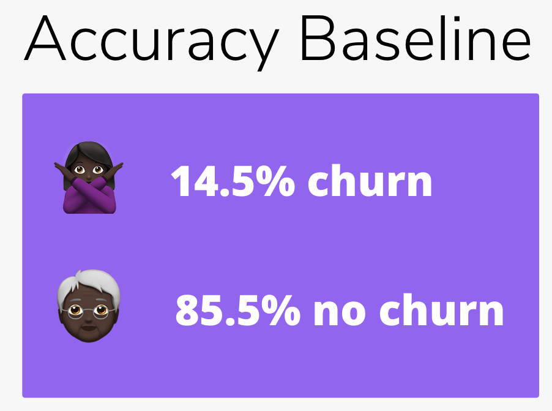

# ChurnAnalysis

**Author**: Dan Lee

## Business Problem

A startup telecommunications company has hired us to provide business recommendations specifically for current customer retention. Our recommendations will significantly shape the company's strategy regarding customer churn. Customers are the greatest asset an organization can have. The longer a customer stays with a company, the more valuable they are because they are paying for more goods and services over time. Since it can cost a company [5 times](https://www.invespcro.com/blog/customer-acquisition-retention/) as much to acquire a new customer as it can to keep one, proper churn management is essential to the success of any organiziation.

The question we will attempt to answer is:

**How reliably can we predict customer churn?**

And if we can reliably predict churn, **can our data tell us how to keep more customers from leaving?**

## Data Understanding

We will be analyzing a public dataset for a telecom company which includes customer usage pattern and if they have churned or not. In our hypothetical business problem, we will assume this is our client's customer usage data.

## Data Preparation

We will explore the data to delete extraneous features.

## Modeling
For all following models, we will evaluate and optimize for:
1. Recall - Our company can afford false positives more than it can afford false negatives. If actual churners fall through the cracks (false negative), the company can lose much more than if it incorrectly incentivizes non-churning customers (false positive) to stay
2. F1 score, Accuracy - For general correctness

## Results

### Model-less Baseline 85.5% Accuracy


### KNN 'Simple Model' 85.7% Accuracy


### Grid Search Optimized: Random Forest - 'Final Model' 84.5% Accuracy


### Feature Importances


## Evaluation
After model selection and optimization over many iterations, the resulting findings are:
1. We can reliably predict customer churn with 84.5% accuracy. This is similar to the model-less baseline (85.5%). Why is our final model better than the model-less baseline? If the company guesses all of their customers as the majority class (not churn), this will not get them anywhere in targeting potential churners. Using our model will give quality guesses at who is likely to churn.
2. Higher total **customer service calls** and having an **international plan** are possible starting points in identifying customers who are prone to churn.

### Recommendations
1. Use our final model to identify customers who are soon likely to churn. Offering these customers special incentives to stay may significantly decrease monthly/yearly churn.
2. Volume of customer service calls and having an international plan can help with early detection.

## Repository Structure

```
├── README.md     
<- The top-level README for reviewers of this project
├── ChurnAnalysis.ipynb   
<- Narrative documentation of analysis in Jupyter notebook
├── ChurnAnalysis.pdf
<- PDF version of Jupyter notebook
├── Non Tec Presentation - NonTecPresentation.pdf        
<- PDF version of project presentation
├── data                                
<- Both sourced externally and generated from code
└── images                              
<- Both sourced externally and generated from code
```
≈